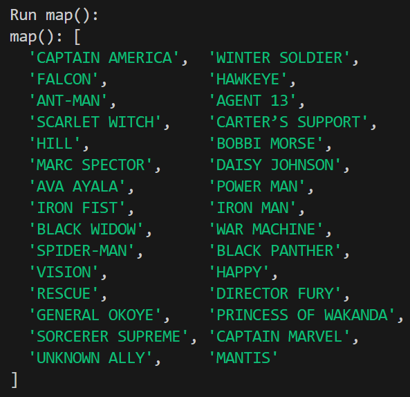

# Week 5 - Array Methods

## Identitas
- Nama : `Excel Caesariano`
- NIM  : `F1D022118`

---

## Deskripsi Tugas
Tugas ini bertujuan agar mahasiswa memahami dan mampu menggunakan **6 metode penting Array di JavaScript** yaitu:
- `map()`
- `filter()`
- `reduce()`
- `find()`
- `some()`
- `every()`

---

## Implementasi
Dataset yang digunakan adalah **30 karakter dari Civil War (Team Captain America vs Team Iron Man)**.  
Setiap metode diimplementasikan dengan kasus berbeda sesuai fungsinya.

### 1. map()
- **Tujuan**: Mengubah semua alias karakter menjadi huruf besar untuk keperluan tampilan atau standarisasi data.
- **Screenshot**:  
  

  

---

### 2. filter()
- **Tujuan**: Menyaring karakter yang memiliki `power > 90` untuk mendapatkan daftar karakter terkuat.
- **Screenshot**:  
  
  
  

---

### 3. reduce()
- **Tujuan**: Menghitung total kekuatan (`power`) dari semua karakter untuk analisis keseluruhan kekuatan tim.
- **Screenshot**:  
  
  
  

---

### 4. find()
- **Tujuan**: Mencari karakter tertentu, misalnya karakter yang namanya diawali dengan `"Steve"`.
- **Screenshot**:  
  
  
  

---

### 5. some()
- **Tujuan**: Mengecek apakah ada karakter yang memiliki peran `"Magic"` di dalam dataset.
- **Screenshot**:  
  
  
  

---

### 6. every()
- **Tujuan**: Mengecek apakah semua karakter memiliki `power > 50` sebagai validasi dataset.
- **Screenshot**:  
  
  
  

---

## Kesimpulan
Dari percobaan keenam metode array:
- `map()` sangat berguna untuk **transformasi data**.
- `filter()` dipakai untuk **menyaring data** sesuai kriteria.
- `reduce()` berguna untuk **mengagregasi/menghitung total** dari seluruh data.
- `find()` efektif untuk **mencari satu elemen spesifik**.
- `some()` membantu mengecek **apakah ada kondisi tertentu terpenuhi**.
- `every()` digunakan untuk **validasi bahwa semua elemen memenuhi kondisi**.